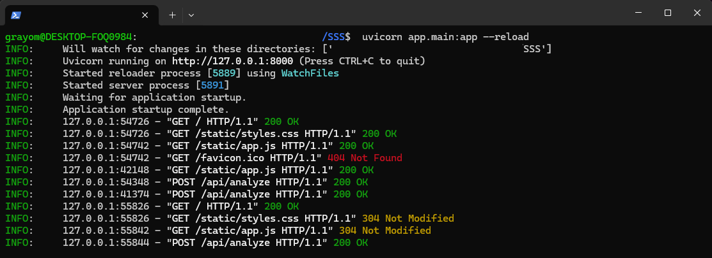
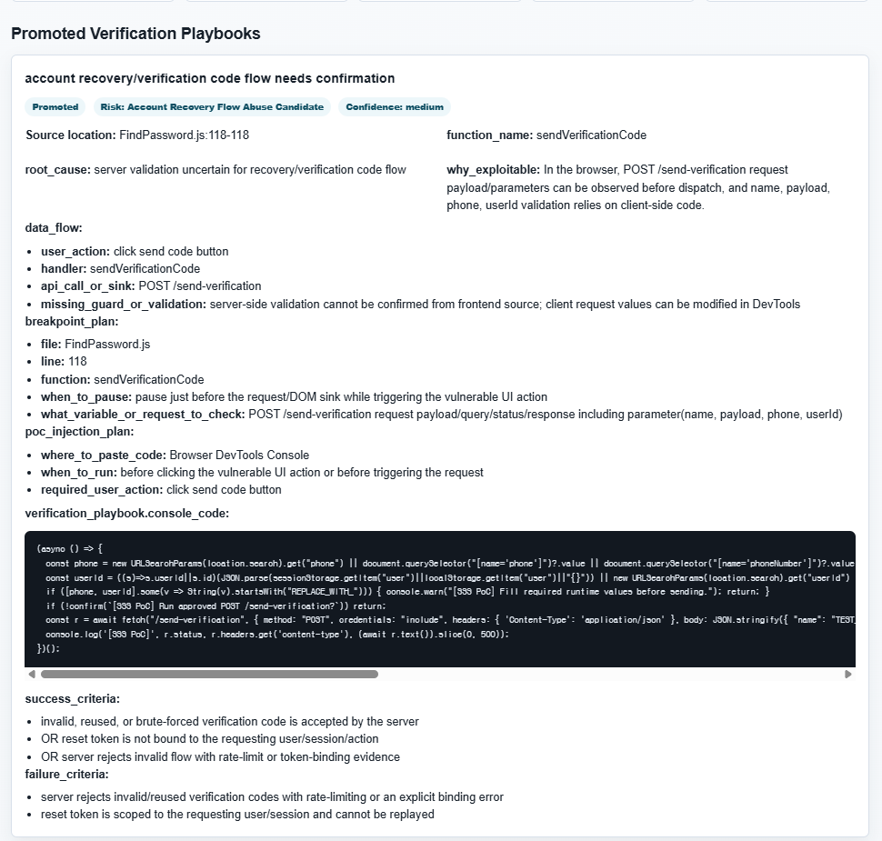

# AI Source Vulnerability Analyzer

보안 진단자가 웹 애플리케이션 프론트엔드 소스코드를 빠르게 검토할 수 있도록 만든 FastAPI 기반 취약점 분석 보조 도구입니다. ZIP 파일을 업로드하면 분석 대상 파일을 선별하고, AI 또는 mock 백엔드로 취약점 후보와 브라우저 콘솔 검증용 PoC를 정리합니다.

## 주요 기능

- ZIP 업로드 기반 소스 분석
- JS, HTML, TypeScript, JSX, TSX, Vue 등 프론트엔드 파일 선별
- ZIP Slip, 경로 조작, 심볼릭 링크, 파일 크기 초과 방어
- 취약점 후보, 위험도, 발생 위치, 영향도, 재현 절차, 증적, 개선 권고 정리
- 브라우저 콘솔에서 확인 가능한 짧은 PoC 또는 수동 검증 계획 생성
- 분석 결과 SQLite 저장 및 이력 조회 API 제공
- mock 백엔드로 API Key 없이 시연 가능

## 프로젝트 구조

```text
app/
  api/          FastAPI 라우터
  core/         환경 설정
  models/       요청/응답 스키마
  services/     업로드, 스캔, 분석, PoC, 저장 로직
  static/       웹 UI JavaScript/CSS
  templates/    메인 HTML 화면
evidence/       실행 및 분석 결과 시연 증적 이미지
scanner/        보안 분석 보조 에이전트와 도구
tests/          단위/API/보안 회귀 테스트
```

## 실행 준비

Python 3.9 이상이 필요합니다.

```bash
python -m venv .venv
source .venv/bin/activate        # Windows: .venv\Scripts\activate
pip install -r requirements.txt
cp .env.example .env
```

기본값은 API Key가 필요 없는 mock 모드입니다.

```env
ANALYZER_BACKEND=mock
POC_BACKEND=mock
```

Gemini를 사용할 경우 `.env`에 다음 값을 설정합니다.

```env
ANALYZER_BACKEND=gemini
POC_BACKEND=gemini
GEMINI_API_KEY=your-api-key
GEMINI_MODEL=gemini-2.5-flash-lite
```

API Key, Token, Cookie, Password는 코드에 직접 작성하지 말고 `.env`에만 저장하세요.

## 로컬 실행

```bash
uvicorn app.main:app --reload
```

브라우저에서 다음 주소로 접속합니다.

```text
http://127.0.0.1:8000
```

Docker로 실행할 수도 있습니다.

```bash
docker compose build
docker compose up
```

## 사용 방법

1. 진단 권한이 있는 웹 프로젝트를 ZIP 파일로 준비합니다.
2. `http://127.0.0.1:8000`에 접속합니다.
3. ZIP 파일을 업로드하고 분석을 실행합니다.
4. 결과 화면에서 다음 항목을 확인합니다.
   - Executive Findings
   - Promoted Verification Playbooks
   - Manual Review Candidates
   - Common Console Helper
5. PoC가 생성된 항목은 안내 순서에 따라 테스트 브라우저 콘솔에서 검증합니다.

API로 직접 실행할 수도 있습니다.

```bash
curl -X POST http://127.0.0.1:8000/api/analyze \
  -F "file=@target-project.zip"

curl http://127.0.0.1:8000/api/analysis-runs
```

## 시연 증적

시연 증적 PNG는 저장소의 `evidence/` 폴더에 보관합니다. README에서 바로 표시되도록 파일명은 공백 없는 영문 소문자 이름을 사용합니다.

```text
evidence/run-example.png
evidence/analysis-result-example.png
```

### 1. 서버 실행 증적

아래 화면은 `uvicorn app.main:app --reload`로 서버가 정상 기동되고, 브라우저 접속 및 `/api/analyze` 요청이 처리된 상태를 보여줍니다.



### 2. 분석 결과 증적

아래 화면은 ZIP 소스 분석 후 `Promoted Verification Playbooks`가 생성되고, 발생 위치, 함수명, 원인, 데이터 흐름, PoC 코드, 성공/실패 기준이 출력된 상태를 보여줍니다.



추가 증적이 필요할 경우 다음 화면을 더 캡처하면 됩니다.

1. 메인 화면: ZIP 업로드 UI
2. 분석 이력 API: `/api/analysis-runs` 응답 화면
3. JSON 다운로드 파일: `analysis_result.json`

실제 고객/업무 소스코드가 보이면 파일명, 도메인, 토큰, 개인정보를 마스킹한 뒤 제출하세요.

## 테스트

```bash
make test
```

또는 직접 실행합니다.

```bash
python -m pytest tests/ -v
```

주요 테스트 범위는 업로드 제한, ZIP 보안 정책, 파일 필터링, 분석 서비스, PoC 생성, API 라우트, UI 렌더링 회귀입니다. 테스트 실패 시 보안 제한을 완화하지 말고 원인을 수정해야 합니다.

## 보안 설정

- 허용 확장자와 MIME/크기 제한을 유지하세요.
- ZIP Slip, path traversal, 심볼릭 링크 차단 로직을 약화하지 마세요.
- 외부 URL 요청 기능을 추가할 경우 SSRF 방어를 포함하세요.
- 로그에 API Key, Token, Cookie, Password가 남지 않게 처리하세요.
- 분석 대상은 반드시 진단 권한이 있는 소스코드만 사용하세요.

## 결과 저장

분석 이력은 기본적으로 SQLite에 저장됩니다.

```env
ANALYSIS_DB_PATH=/tmp/ai_code_analyzer/analysis_runs.sqlite3
```

운영 또는 장기 보관 환경에서는 저장 경로 권한, 백업 정책, 민감정보 포함 여부를 별도로 점검하세요.
